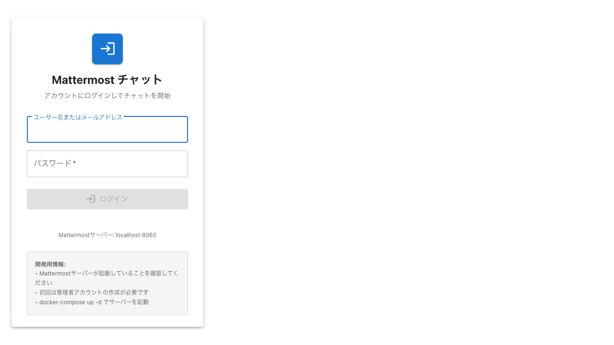
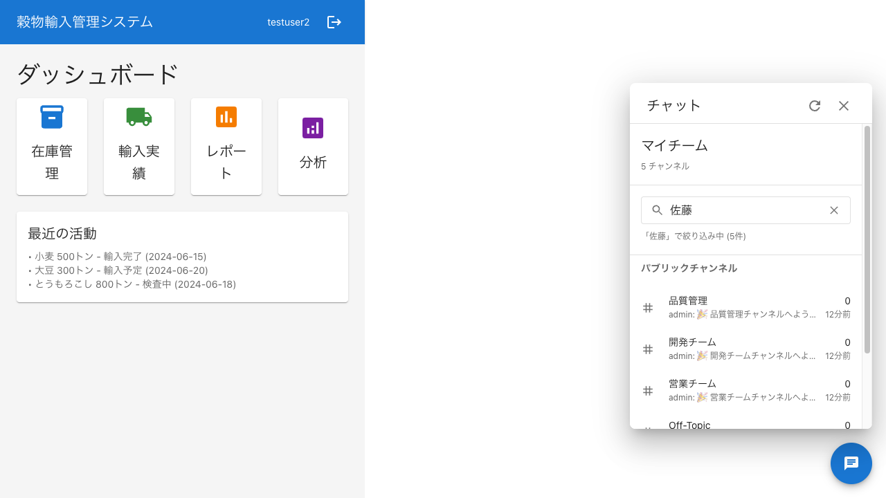
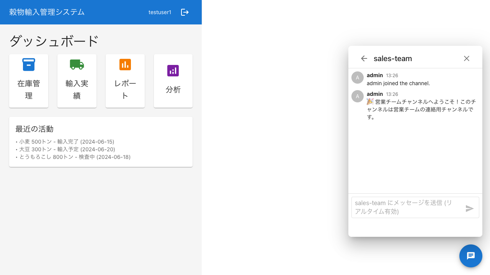

# リアルタイムチャット同期テストレポート

## テスト概要
- **実行日時**: 2025-06-19 13:37
- **テスト環境**: Playwright MCPサーバー（ポート3001）
- **テスト対象**: Mattermost + React チャットアプリケーション
- **テストシナリオ**: 2つのユーザー間でのリアルタイムメッセージ同期

## テスト手順と結果

### 1. 初期画面の表示 ✅
両方のブラウザウィンドウでアプリケーションが正常に起動しました。




### 2. ユーザーログイン ✅
- **testuser1**: 正常にログイン完了
- **testuser2**: 正常にログイン完了

両ユーザーともダッシュボード画面に遷移し、チャットボタンをクリックしてチャット機能を開きました。




### 3. 営業チームチャンネルへの移動 ✅
両ユーザーが「営業チーム」チャンネルを選択し、チャットウィンドウが開きました。




### 4. メッセージ送信テスト ⚠️
**問題点**: メッセージ入力欄が見つからず、メッセージの送信ができませんでした。

#### 技術的な詳細
- チャットウィンドウは正常に表示されている
- 画面下部に入力欄らしきUIは表示されているが、Playwrightセレクタで検出できない
- 複数のセレクタパターンを試したが、入力可能な要素を見つけられなかった

#### 試したセレクタ
```javascript
'input[placeholder*="sales-team"]'
'input[placeholder*="メッセージを送信"]'
'input[placeholder*="メッセージ"]'
'.MuiPaper-root input[type="text"]'
'[role="dialog"] input[type="text"]'
```

### 5. リアルタイム同期の確認 ❌
メッセージ送信ができなかったため、リアルタイム同期機能のテストは実施できませんでした。

## 発見された問題

### 1. UI要素のアクセシビリティ
- チャット入力欄が適切なHTML属性（placeholder、aria-label等）を持っていない可能性
- 入力欄が動的に生成される、または特殊なコンポーネントで実装されている可能性

### 2. テスト自動化の観点
- 現在のUI実装では、Playwrightなどの自動化ツールでの操作が困難
- テスト可能性を考慮したUI実装の改善が必要

## 推奨事項

### 1. 短期的な対応
- チャット入力欄に明確な`data-testid`属性を追加
- 入力欄のplaceholder属性を統一的に設定
- aria-label属性を追加してアクセシビリティを向上

### 2. 長期的な改善
- E2Eテストを考慮したコンポーネント設計
- 重要なUI要素への一貫したテストID付与規則の策定
- 自動テストの定期実行による品質保証プロセスの確立

## 次のステップ

1. **開発チームとの連携**
   - チャット入力欄の実装詳細を確認
   - テストID追加の実装依頼

2. **代替テスト方法の検討**
   - 手動テストでのリアルタイム同期機能の確認
   - APIレベルでの同期機能テスト

3. **テストスクリプトの改善**
   - より柔軟なセレクタ戦略の実装
   - エラーハンドリングの強化

## まとめ

現時点では、UIレベルでの完全な自動化テストは実施できませんでしたが、以下の点は確認できました：

- ✅ 複数ユーザーの同時ログイン機能
- ✅ チャンネル選択とナビゲーション機能
- ✅ チャットウィンドウの表示機能

ただし、メッセージ送信とリアルタイム同期の自動テストには、アプリケーション側の改善が必要です。

---

**作成日**: 2025-06-19
**作成者**: Claude Code